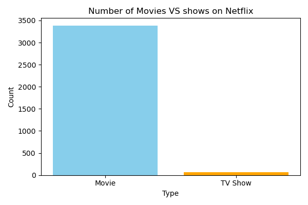
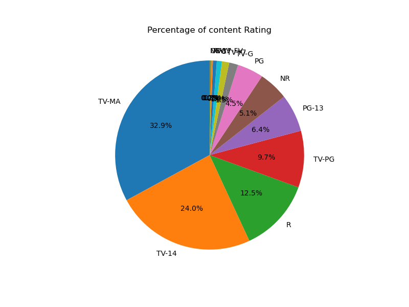
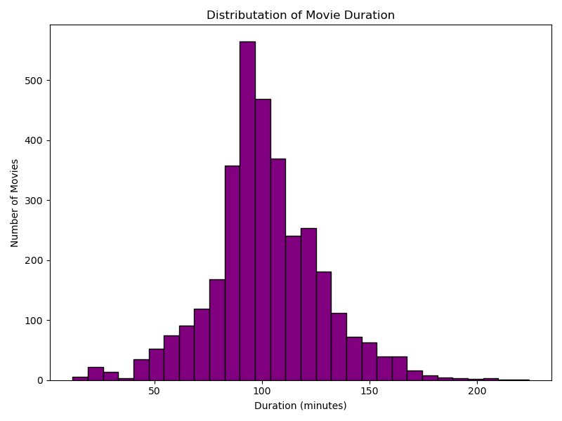
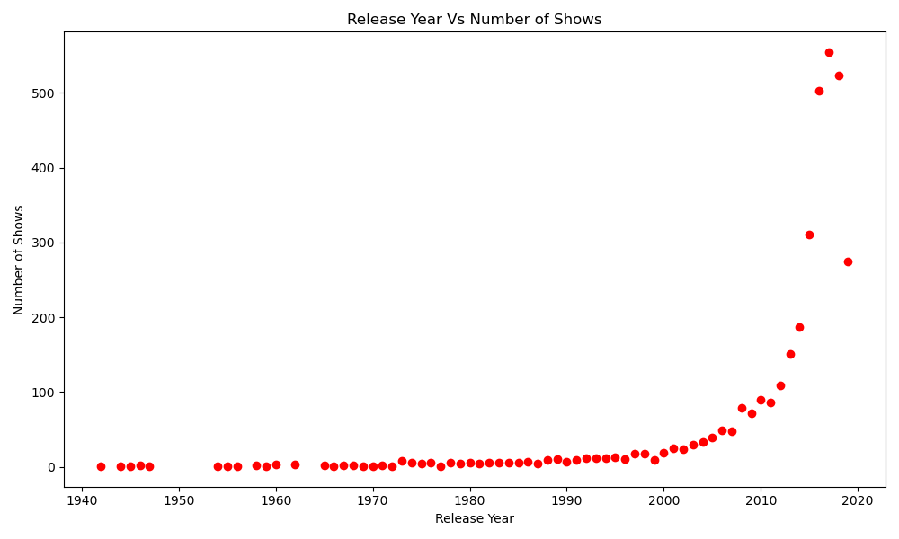
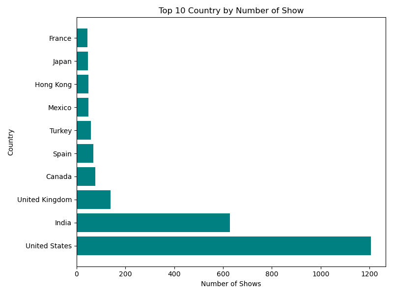
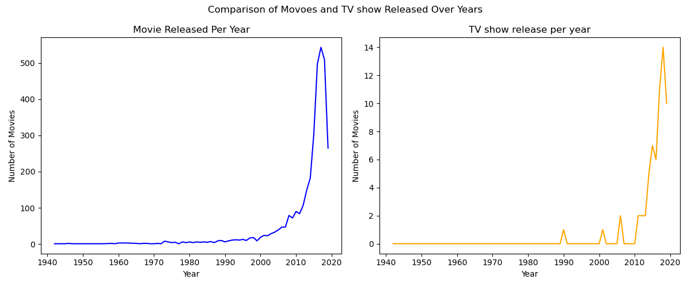

# 🎬 Netflix Data Analysis

## 📌 Project Overview
This project analyzes the Netflix Movies and TV Shows dataset using Python, Pandas, and Matplotlib.

## 🛠️ Technologies Used
- Python
- Pandas
- NumPy
- Matplotlib
- Jupyter Notebook

## 📊 Analysis Performed
- Data Cleaning
- Movies vs TV Shows
- Content Rating Distribution
- Movie Duration Distribution
- Release Year Analysis
- Top 10 Countries
- Movies vs TV Shows Released Over Time

## 📈 Project Outputs

### Movies vs TV Shows

### Content Ratings

### Movie Duration

### Release Year

### Top Countries

### Movies vs TV Shows Comparison

## 🎯 Key Insights
- Netflix has more Movies than TV Shows.
- Most content was released after 2015.
- The United States has the highest number of titles.
- TV-MA is the most common content rating.

## 👨‍💻 Author
**Sumedh Ingole**
